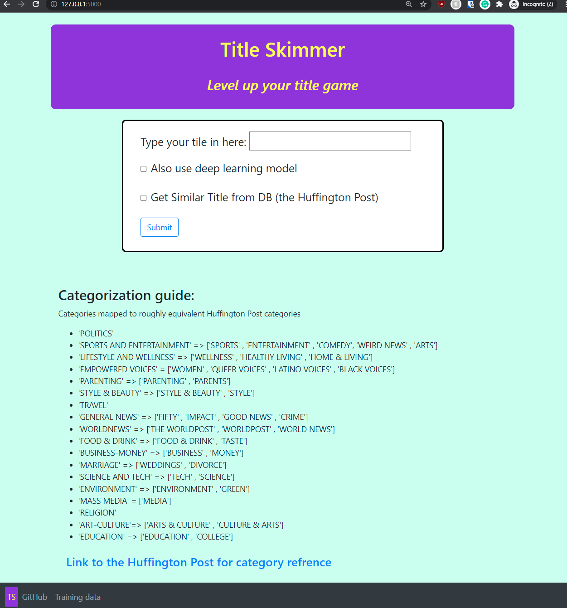
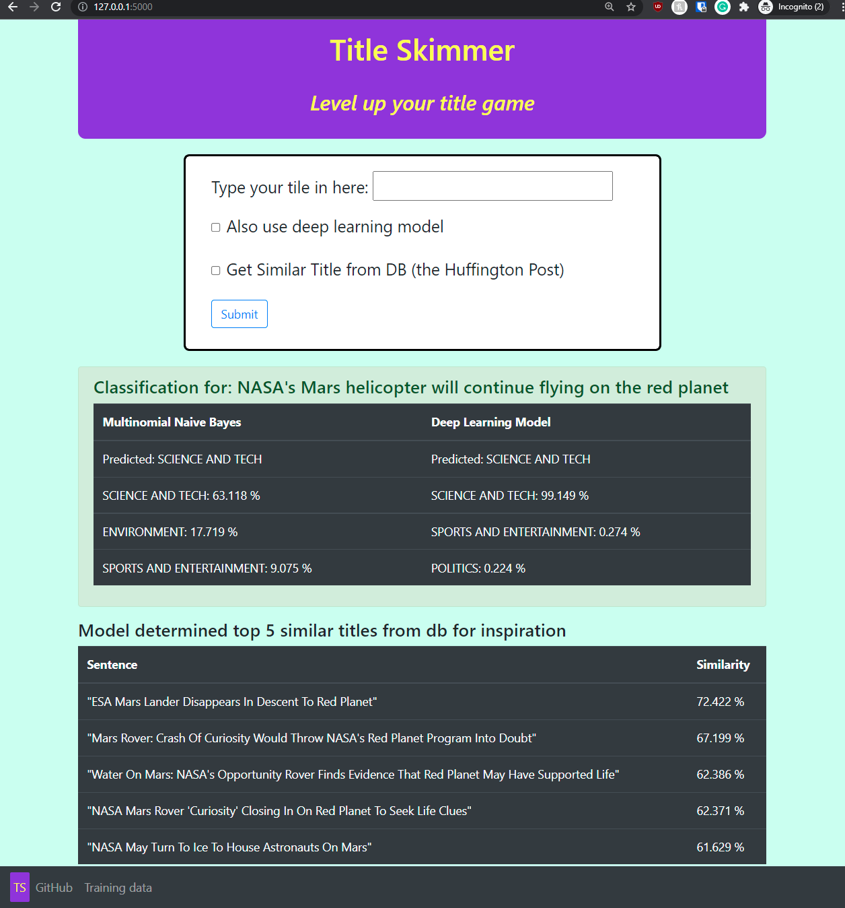

# About Me
  
Hello there, my name is Michael Cai.   
I am an undergraduate attending CUNY Queens College pursuing a bachelor's degree in Computer Science.   
Currently I have a GPA of 3.97 and a expected graduation date of June 2022.  

```markdown
Courses I have completed include: 
- Object-Oriented Programming in Java and in C++  
- Software Engineering  
- Data Structures 
- Theory of Computation  
- Functional Programming  
- Design & Analysis of Algorithms   
- Database Fundamentals  
- Data Analytics  
- Internet & Web Technologies    
- Numerical Methods  
- Computaitonal Finance  
```

Outside of academic marks, I enjoy working with peers and being a team player. My efforts to use clear communication and organization of assigning tasks had led to much success in leadership. In high school, I have been elected as the head of engineer for the robotics team for my ability to explain mechanical concepts and delegate tasks effectively. In college I led multiple group projects and recieved acknowledgement from both my peers and professors for teamwork. 

I also worked as a tutor at the Academic Support Center at Queens College for the database course.

Currently, I am looking into studying data science and cybersecurity as potential career options. 

## Resume by Me 

[Resume 2021](resume/Cai_Resume_2022.pdf)

## Recent Projects  
  
### Title Skimmer for CUNY Tech Prep - Dec. 2021  

| [README](https://github.com/michael0419/TitleSkimmer#readme)  | [GitHub](https://github.com/michael0419/TitleSkimmer)  | [Website (lite version)](https://title-skimmer-lite.herokuapp.com/) |  
 

  

### Food For Thought for CUNY Hackathon - Jan. 2021  

| [README](https://github.com/Slaeh/FoodForThought#readme)  | [GitHub](https://github.com/Slaeh/FoodForThought)  | [Website](https://food-for-thought-psi.vercel.app/) |  
 
  


### ShortUrlScanner - Jan. 2021 

| [GitHub](https://github.com/michael0419/ShortUrlScanner) |  

 
 
A node.js project that scans a url for you and gives a shotened link of the results.  


## Contact Me  

| [Linkedin](https://www.linkedin.com/in/michael-cai-a6515921b/)  | [GitHub](https://github.com/michael0419) |  

