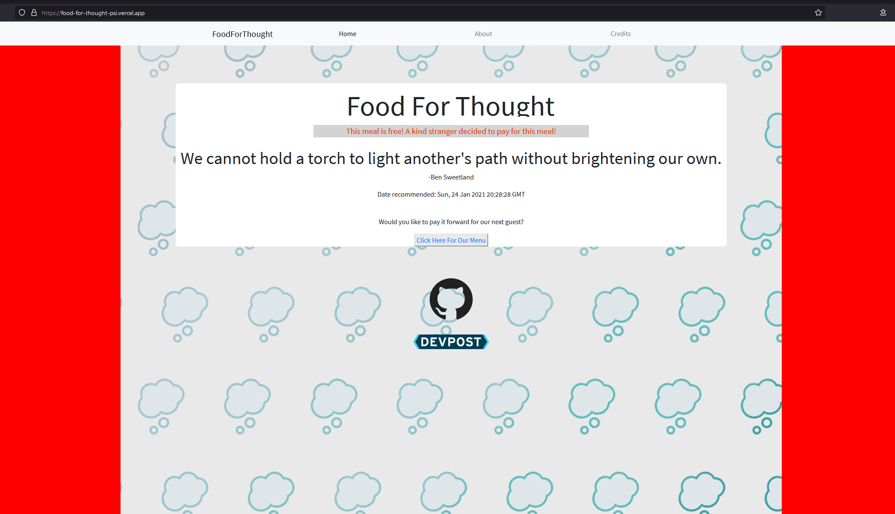
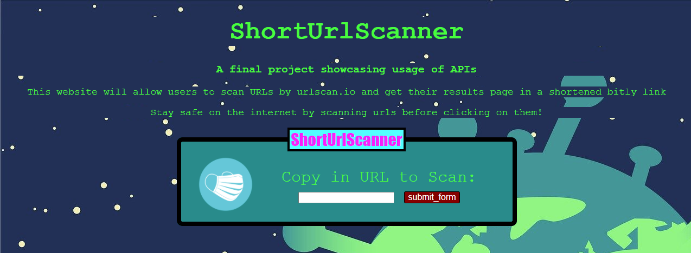

# About Me

Hi, I'm a person. My name attribute is up there and my story starts here. 

I'm currently an undergraduate attending CUNY Queens College, 
working on getting my Bachelor's degree in Computer Science.

```markdown
So far, I have completed classes on: 
- Object-Oriented Programming in Java and in C++
- Theory of Computation
- Functional Programming
- Data Structures 
- Design & Analysis of Algorithms 
- Database Fundamentals
- Internet & Web Technologies

And classes in this list would soon join their bretheren:
- Numerical Methods
- Computaitonal Finance
- Data Analytics
- Software Engineering
```

TBD.
## Resume by Me 

[Resume 2021](resume/Cai_Resume_2021.pdf)

## Recent Projects  

### Food For Thought - CUNY Hackathon Jan. 2021  
  

| [README](https://github.com/Slaeh/FoodForThought#readme)  | [GitHub](https://github.com/Slaeh/FoodForThought)  | [Website](https://food-for-thought-psi.vercel.app/) |  

### ShortUrlScanner  
 
 
A node.js project that scans a url for you and gives a shotened link of the results.  

| [GitHub](https://github.com/michael0419/ShortUrlScanner) |

### Contact Me  

| [Linkedin](https://www.linkedin.com/in/michael-cai-a6515921b/)  | [GitHub](https://github.com/michael0419) |  

